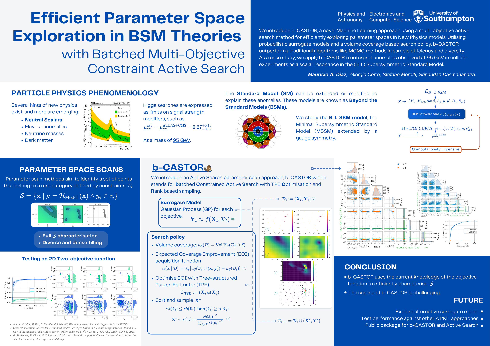

I had the opportunity to give a flash-talk at the European AI for Fundamental Physics Conference in Amsterdam, where I shared my work on using an Active Search approach to explore the parameter space of Beyond Standard Model (BSM) theories.

Here you can see how it went!
<iframe width="560" height="315" src="https://www.youtube.com/embed/xeEQRdjIwHg?si=OHTtbddCIWSLtO1d" title="YouTube video player" frameborder="0" allow="accelerometer; autoplay; clipboard-write; encrypted-media; gyroscope; picture-in-picture; web-share" referrerpolicy="strict-origin-when-cross-origin" allowfullscreen></iframe>

I needed to compress it into just three minutes, but I was happy with how the talk went. It was the first time I felt satisfied with both the delivery and the results of my project. I also presented this poster,

There was good feed back, specially on the needs of different functionalities on parameter scan methods. When dealing with multi-objectives is hard to define the priority of each objectie in a single "scalarised" policy. This gave me some ideas on adding this prioritisations of objectives in the library Python library I am writing for Active Search Methods for Parameter Scans.

# Abstract
Phenomenological analyses in beyond the Standard Model (BSM) theories assess the viability of BSM models by testing them against current experimental data, aiming to explain new physics signals. However, these analyses face significant challenges. The parameter space in BSM models are commonly large and high dimensional. The regions capable of accommodating a combination of experimental results, is often sparse and potentially disconnected. Moreover, the numerical evaluation for each configuration computationally expensive.

To address these challenges, our work introduces a batched Multi-Objective Constrained Active Search approach. Physical observables and statistical tests, such as particle masses and $\chi^2$-tests from experimental data respectively, are defined as the objectives with pre-defined constraints. We use probabilistic models as surrogates for the objectives to enhance sample efficiency, and a volume-based active sampling strategy, that uses the surrogates to effectively characterise and populate satisfactory regions within the parameter space of BSM models.

We employ the algorithm with the B-L SSM model to accommodate results an observed signal at $\sim 95 \mathrm{GeV}$ in neutral scalar searches in $h \rightarrow \gamma \gamma$ channel. We found that the algorithm efficiently identifies satisfactory regions in the parameter space of the B-L SSM model, improving previous studies in this model. We conclude by outlining future directions for this research, and sharing the developed tools for the community's use.
